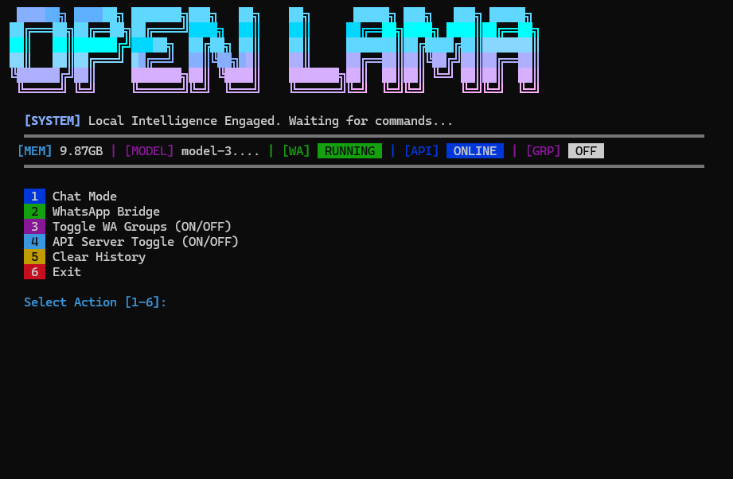
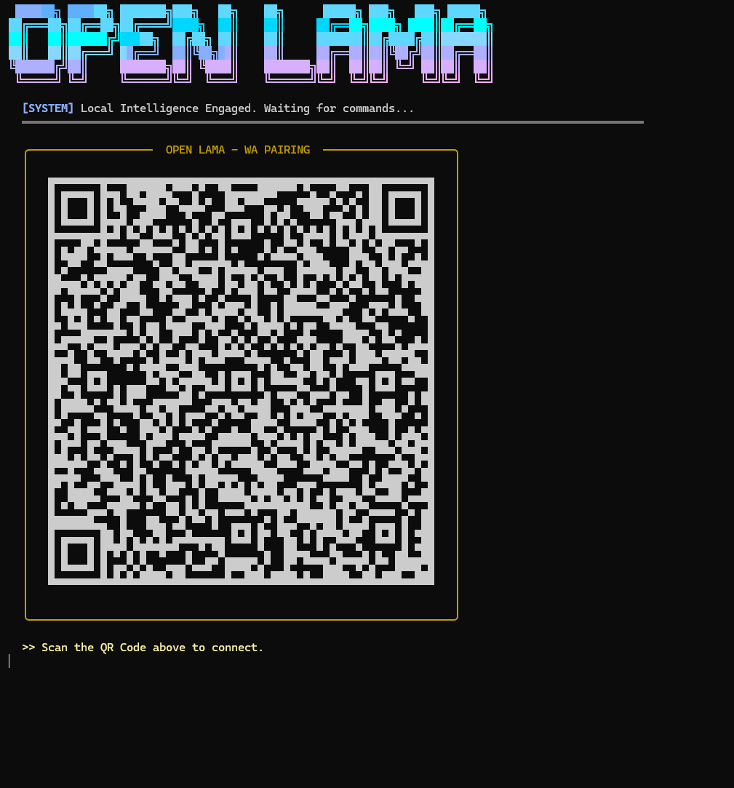

# 🦙 OPEN LAMA - Sovereign Local Intelligence



[](https://www.typescriptlang.org/)
[](https://nodejs.org/)
[]()
[]()

**OPEN LAMA** is a production-grade Terminal User Interface (TUI) for running high-performance Llama models locally. It bridges the gap between raw local AI power and daily productivity through seamless WhatsApp integration and a secure REST API.

---

## 🚀 Key Features

### 🧠 Pure Local Intelligence
Experience AI without the cloud. Every byte of your data stays on your machine, processed by optimized `.gguf` models via `node-llama-cpp`.

### 📱 WhatsApp Bridge (Zero-API Dependency)

Turn your WhatsApp into a personal AI powerhouse. Features include:
- **Private & Group Mode**: Toggle between responding to everyone or just private chats.
- **Auto-Cleanup**: Session data is securely wiped upon logout.
- **User Memory**: Separate conversation history for every contact.

### 🌐 Secure API Server
Integrate OPEN LAMA into your own apps with a built-in REST API:
- **Bearer Token Auth**: Automatically generated and persisted in `config.json`.
- **Headless Service**: Run the entire system as a background service using `npm run serve`.

---

## 🛠️ Installation

### 1. Prerequisites
- **Node.js** (v18 or higher)
- **C++ Build Tools** (Required for `node-llama-cpp` compilation)

### 2. Setup
```bash
# Clone the repository
git clone https://github.com/OpenLamaofc/open-lama.git
cd open-lama

# Install dependencies
npm install
```

### 3. Add Your Models
Place your favorite `.gguf` models in the `model/` directory.
> [!TIP]
> We recommend **Llama 3.2 3B** for text or **Moondream2** if you wish to enable local vision features in the future.

---

## 🎮 Usage

### Interactive Mode (TUI)
Perfect for daily use and managing your AI engine.
```bash
npm start
```

### Service Mode (Headless)
Ideal for servers, Raspberry Pi, or long-running background tasks.
```bash
npm run serve
```

---

## 📡 API Documentation

Access the local AI server via standard HTTP requests.

**Endpoint:** `POST http://localhost:3000/v1/chat`  
**Auth:** `Authorization: Bearer <your_api_key>`

**Request Body:**
```json
{
  "prompt": "Hello AI!",
  "sessionId": "custom-user-id"
}
```

---

## 🛡️ Security & Privacy
- **100% Local**: No external APIs are used for text or image processing.
- **Encrypted Bridge**: Powered by `@whiskeysockets/baileys` for secure WhatsApp pairing.
- **Ephemeral Memory**: AI session memory is kept in-memory and can be cleared instantly.

---

## 👨‍💻 Developed By
Created with passion by **openlama㉿server.ai**. Focused on bringing sovereign AI to everyone.

---
*Open Lama is an open-source project. Contribute and make local AI better!*
